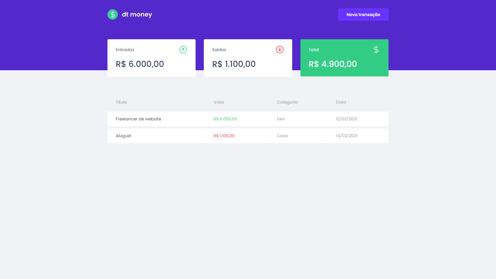
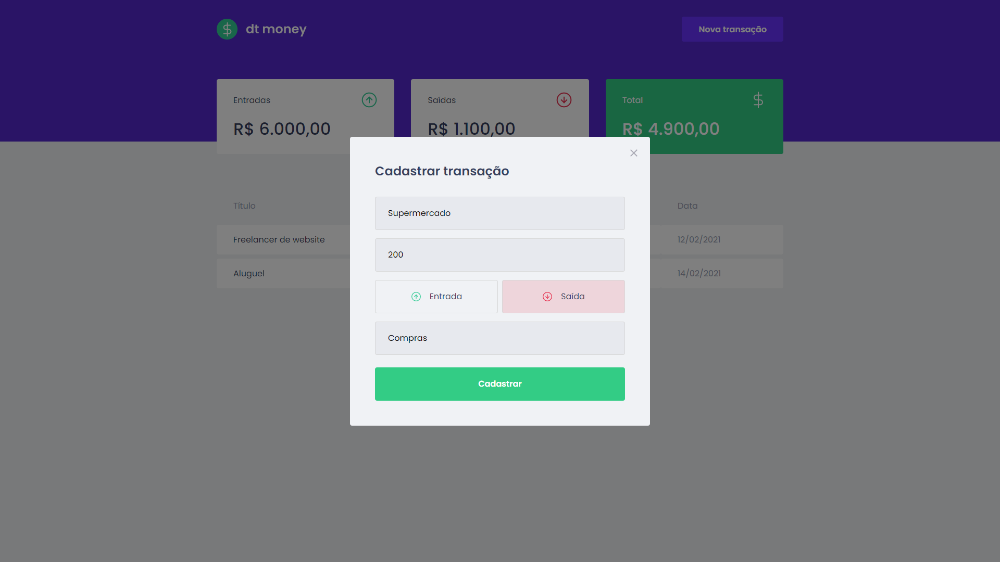

<div align="center">
  
</div>

<hr />

## Available Scripts

In the project directory, you can run:

```
yarn start
```

Runs the app in the development mode.\
Open [http://localhost:3000](http://localhost:3000) to view it in the browser.

<hr />

## App Screenshots

<br />

- Dashboard <br /><br />


- Transactions register <br /><br />



<p align="center">Made with 💜 by Vinicius Victor in Ignite | Rocketseat</p>